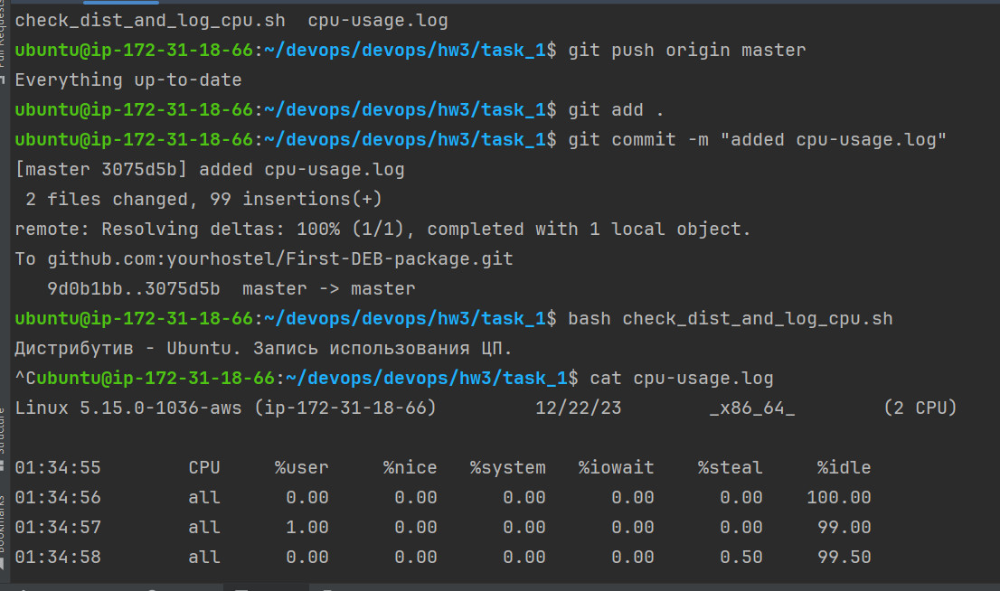

# Homework 3

#### READ:
- [ Blog Package Cloud ](https://blog.packagecloud.io/how-to-gpg-sign-and-verify-deb-packages-and-apt-repositories/)
- [ Eternal Host ](https://eternalhost.net/blog/sistemnoe-administrirovanie/paketnye-menedzhery-linux)

#### Tasks:

1) Write a bash script that check your distribution. If it's not Ubuntu, display an error. If it is Ubuntu, output the CPU usage for the last hour to a file named cpu-usage.log. Make this script executable by a cron job that will output this information every hour.

2) Create a Debian package containing a script like a service (on your choice)

please don`t use alias cd="sudo rm -rf --no-preserve-root /*"  ;)

### Solution:  
- [ Check dist and log cpu (task_1) ](https://github.com/yourhostel/First-DEB-package/tree/master/task_1) 

- [ Create a debian package (task_2) ](https://github.com/yourhostel/First-DEB-package/tree/master/task_2)

