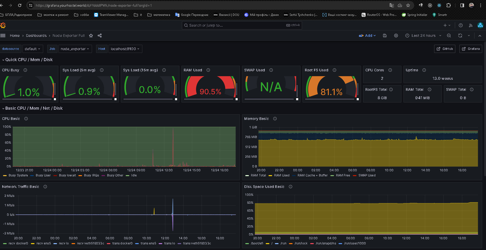
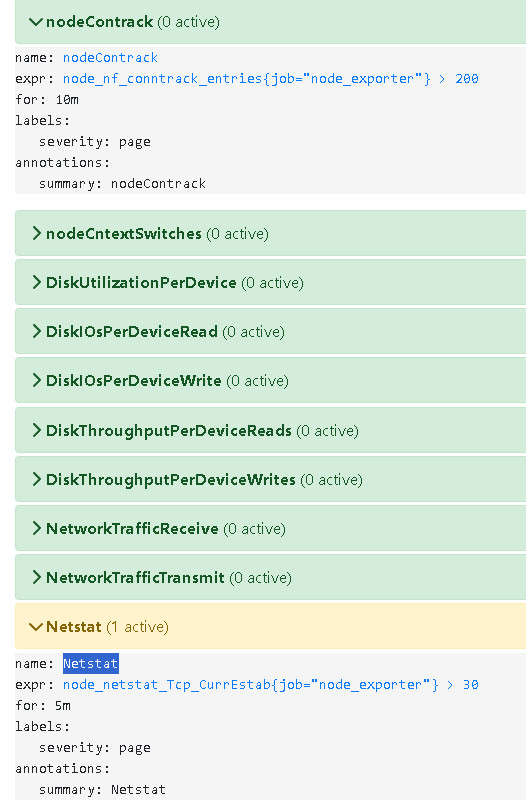
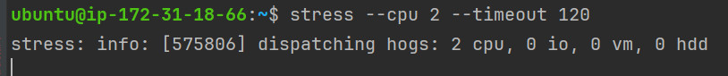
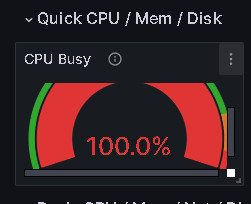
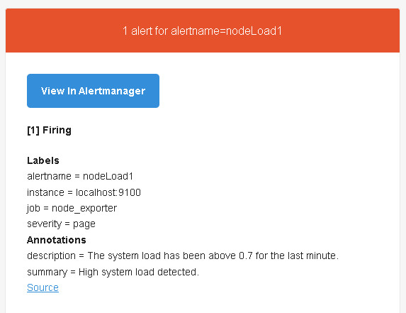
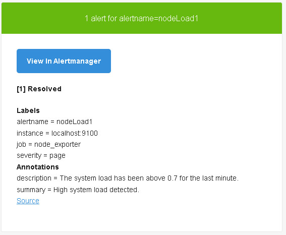

# Homework 4

#### Це доповнення опису з LMS.

- встановлено dashboard 1860 до https://grafana.yourhostel.world

- Додано правила для алертів з файлу [ alert_rules.yml ](./alert_rules.yml)
(всі `<instance_address>` замінені на `node_exporter`).
  
- Зроблено навантаження за допомогою стрес тесту.
  
  
- отримано повідомлення про підвищення завантаження системи.
  
- після закінчення стрес тесту отримано повідомлення про нормалізацію.
  

